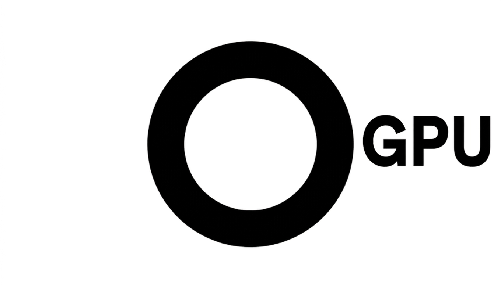

<p align="center"></p>

<p align="center"><b>Minimal WebGPU framework.</b></p>

<p align="center"><a href="https://oframe.github.io/ogpu/">Examples</a></p>

<br />

OGPU is a small WebGPU framework that continues the ethos of [OGL](https://github.com/oframe/ogl): an approachable interface with a thin abstraction layer that keeps easy access to the metal — in this case, WebGPU. It belongs to the [OFrame](https://github.com/oframe) family, carrying the same minimal-abstraction philosophy that [Nathan Gordon](https://github.com/gordonnl) set with OGL.

Written in vanilla ES modules with a Vite build, the API shares many similarities with THREE, but it is tightly coupled to WebGPU and ships far fewer features. The library does the minimum abstraction necessary, so you should still feel comfortable reaching for native WebGPU commands alongside it.

Keeping the level of abstraction low makes the framework easier to understand, extend, and reshape — and makes it a far more practical resource for learning WebGPU itself.

All vertex, fragment, and compute shaders are written — as they should be — in **WGSL**. No node graph, no TSL. You write WGSL, the framework reflects it, and that's the contract. This is a deliberate choice, not a missing feature.

## Not an npm package — a starter culture

OGPU is **not** published to npm, and that's on purpose. There's no build artifact to install and no stable public API to import against.

Treat this repo like a sourdough starter: a strong, living base you take and make your own. Fork it, extend it, or completely reshape it however you see fit. The point isn't a frozen framework — it's a clean, readable WebGPU foundation for either **learning WebGPU** or **growing your own engine** from a base that already has the hard parts solved. Today's LLMs are more than capable of carrying that reshaping for you.

To start:

```bash
git clone https://github.com/oframe/ogpu my-app
cd my-app
npm install
npm run dev        # Vite dev server, default http://localhost:5173
```

## Built for agentic development

OGPU is deliberately geared toward development with coding agents (Claude Code, Codex, Cursor, Gemini CLI). Because you grow it rather than import it, the framework's real value is in how easy it is for an LLM to navigate, reason about, and extend. The strategies baked in for that:

- **`AGENTS.md` is the shared source of truth.** It maps the whole architecture, the cross-cutting model, and the conventions that reflection depends on. `CLAUDE.md` / `GEMINI.md` / the Cursor rule are one-line bridges to it, so nothing is duplicated. Point your agent here first.
- **Per-directory `CLAUDE.md` files.** Each source directory carries its own footguns and _why_, so the right context loads next to the code an agent is editing — not buried in one giant root file.
- **Generated navigation artifacts.** `api-digest.md` is a terse index of the public surface (every exported class, its method signatures, exported functions) — the canonical _what_, so an agent never has to open a file just to learn a signature. `module-graph.json` is the static import graph (who-imports-what, with the structural hubs ranked) — so an agent traces dependencies instead of grepping. Both are regenerated by `npm run repomap` and kept honest by a pre-commit drift gate.
- **Offline WGSL validation.** `npm run validate:shaders` checks every `src/**/*.wgsl` with [naga](https://github.com/gfx-rs/wgpu/tree/trunk/naga), the wgpu reference compiler — so an agent can verify shader edits without a browser. naga isn't bundled; install it with `brew install naga` (or `cargo install naga-cli`). The script exits with code 2 if it's missing.

## Structure

The framework is split into **Core**, **Math**, and **Modules**.

The **Core** (`src/core/`) holds the engine primitives. Two classes carry the weight and are worth understanding first:

- **`RenderPipeline`** — wraps a WGSL render module. It reflects the shader with `webgpu-utils`, builds the pipeline, bind groups, and uniform buffers, and matches standard per-frame uniforms (matrices, camera, time, resolution) to your `Uniforms` struct **by field name**. You write WGSL with a `vs`/`fs` entry pair; the pipeline wires it up.
- **`ComputeShader`** — the compute counterpart. Every entry point in a WGSL compute module becomes a dispatchable kernel keyed by its name, with optional timestamp-query timing. This is the path for GPU compute work — simulation, culling, image processing — without leaving the framework.

The rest of Core:

- `Renderer.js`
- `Transform.js`
- `Camera.js`
- `Mesh.js`
- `Geometry.js`
- `Texture.js`
- `RenderTarget.js`
- `ShaderReload.js` — WGSL hot-reload
- `skin/` — GPU skinning

The **Math** component (`src/math/`) is a set of chainable, THREE-style wrappers over [`wgpu-matrix`](https://github.com/greggman/wgpu-matrix) — `Vec2`–`Vec4`, `Quat`, `Mat3`/`Mat4`, `Euler`, `Color` — each a `Float32Array` subclass.

**Modules** (`src/modules/`) are the optional higher-level pieces, kept out of Core to reduce bloat: `Orbit`, `Raycast`, `GUI`, `Animation`, `GLTFLoader`, `CubeMap`, `VideoTexture`, and a shader-only `pbr/` IBL library.

Examples live in `examples/` (repo root, outside `src/`), switched by a `?src=` query string in `src/main.js`.

## PBR shading & IBL

`src/modules/pbr/` is a shader-only library (no JS, imported with `?raw`). The core piece, `pbr.wgsl`, is a glTF-style metallic-roughness shader lit entirely by IBL. It declares the standard `vs`/`fs` + `uniforms` so it drops into a `RenderPipeline`; material factors live in a `Material` block and maps follow the `t<Name>` convention (`tMap`, `tMetallicRoughness`, `tNormal`, `tOcclusion`, `tEmissive`, `tOpacity`). Normal mapping uses vertex tangents when present, else a screen-space derived frame.

Lighting inputs are built once at init (see `initIBL` in `examples/pbrshader/PBRShader.js` or `examples/gltf/GLTF.js`):

- **Specular cube** — `loadIBLCubeMap(gpu, { url, faceSize, mipLevels })` (`src/utils/IBLUtils/IBLUtils.js`) decodes an EXR/HDR/KTX env map, unpacks to a cube, GGX-prefilters one roughness level per mip. Returns `mipLevels`; feed it back as the `roughnessLevels` override constant so the roughness→lod mapping matches.
- **Diffuse irradiance** — `loadSphericalHarmonics(url)` reads 9 precomputed SH coefficients (e.g. `assets/pbr/artistworkshop_sh.json`) into a `vec4`-padded `Float32Array`. `evaluateSH(normal, …)` reconstructs per-pixel diffuse irradiance — replaces a diffuse-convolved cubemap with a handful of constants.
- **BRDF LUT** — `brdflut.wgsl` (split-sum integration) dispatched into a 512×512 `rgba16float` storage texture, sampled by `nDotV`/roughness.

Composes as `kD · SH-irradiance · albedo + IBL-specular`, applies occlusion/emissive, then tonemaps (filmic) + gamma-encodes. Drop the tonemap tail if rendering into an intermediate target with its own display pass.

> Working in Claude Code? The `pbr-shading` skill (`.claude/skills/pbr-shading/`) walks through folding this shader into a `RenderPipeline` — which WGSL blocks to copy, the full 0–12 bind group, IBL/fallback-texture wiring, and the things that break silently.

## Browser requirements

Needs a browser with WebGPU. As of late 2025 it ships by default in:

- **Chrome / Edge** — 113+
- **Firefox** — Windows 141+, macOS ARM64 145+ (Linux expected 2026)
- **Safari** — macOS Tahoe 26 / iOS 26 / iPadOS 26 / visionOS 26

Mobile is still fragmented — Chrome on Android needs recent hardware, Firefox on Android is behind a flag.

### Testing on a phone (gotcha)

`navigator.gpu` is exposed **only in a secure context** — HTTPS or `localhost`. Hitting the dev server over your LAN IP (`vite --host` → `http://192.168.x.x:5173`) is plain HTTP, so mobile browsers report "WebGPU not supported" even on a capable device. Serve it over HTTPS instead — e.g. a quick tunnel:

```bash
cloudflared tunnel --url http://localhost:5173 --http-host-header localhost:5173
```

That gives a trusted `https://*.trycloudflare.com` URL (no cert to install on the phone). The `--http-host-header` flag rewrites the Host so Vite doesn't block the tunnel domain. A self-signed `vite --https` cert is the worse option — iOS Safari won't trust it.

`Renderer.initDevice` keeps a wishlist of WebGPU features and **feature-detects** it — each is requested only if the adapter exposes it, and anything missing is dropped (and logged) rather than failing device creation. So the engine boots on any WebGPU-capable adapter, while a fully-featured build (e.g. Chrome Canary) still gets everything. Optional features (texture compression, `timestamp-query`, …) may be absent on a given GPU, so guard any code that depends on them. See the "Browser floor" notes in `AGENTS.md`.

## Unlicense

This is free and unencumbered software released into the public domain.

Anyone is free to copy, modify, publish, use, compile, sell, or distribute this software, either in source code form or as a compiled binary, for any purpose, commercial or non-commercial, and by any means.

For more information, please refer to <https://unlicense.org>
